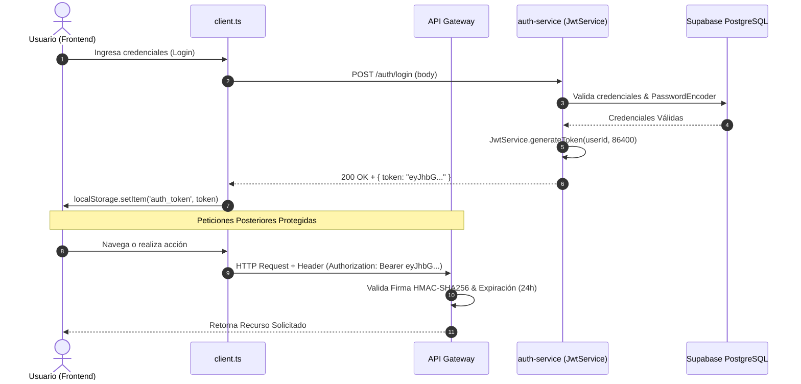
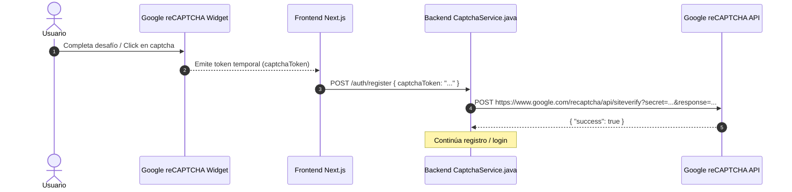
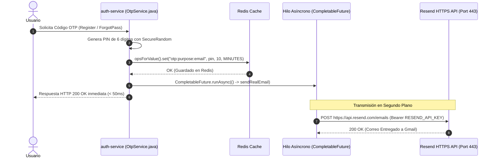

# Documento Técnico de Arquitectura e Integración de APIs — Catch & Go
**Manual de Dominio Técnico, Integraciones y Consumo de APIs (Para Evaluación y Defensa Oral)**

---

## 1. Visión General de la Arquitectura de APIs

El sistema **Catch & Go** se basa en una arquitectura distribuida de microservicios RESTful expuestos a través de un API Gateway y comunicados mediante el protocolo HTTP/HTTPS. Integra servicios externos de clase empresarial para geolocalización, seguridad humana (Captcha) y mensajería en la nube.

### 1.1 ¿Qué es una API REST / RESTful?
REST (*Representational State Transfer*) es un estilo de arquitectura para aplicaciones distribuidas. Una API es RESTful cuando cumple los siguientes principios:
* **Sin Estado (*Stateless*):** Cada solicitud contiene toda la información necesaria (token JWT). El servidor no almacena sesión de usuario.
* **Cliente-Servidor:** Separación entre Frontend (Next.js) y Backend (Spring Boot Java).
* **Métodos HTTP Estándar:** `GET` (Lectura), `POST` (Creación/Acción), `PUT` (Actualización), `DELETE` (Eliminación).
* **Intercambio Ligero:** Formato estructurado JSON (*JavaScript Object Notation*).
* **Códigos de Estado HTTP:** `200 OK`, `400 Bad Request`, `401 Unauthorized`, `403 Forbidden`, `500 Internal Server Error`.

---

## 2. Clasificación e Inventario de APIs Consumidas

| API / Servicio | Tipo | Método HTTP / Protocolo | Endpoint / Host | Propósito | Ubicación en Código Fuente |
|---|---|---|---|---|---|
| **Auth Microservice** | Interna (REST) | `POST`, `GET`, `DELETE` | `http://localhost:8081` / `/auth/*` | Autenticación, Login, Registro, OTP, Passwords | [auth.ts](file:///c:/Users/xkait/Desktop/Catch_Go/Catch-Go/Producto/frontend/src/lib/api/auth.ts#L15-L83) [UserAccountService.java](file:///c:/Users/xkait/Desktop/Catch_Go/Catch-Go/Producto/backend/services/auth-service/src/main/java/com/catchandgo/auth/service/UserAccountService.java#L32-L124) |
| **API Gateway** | Interna (Gateway) | HTTP Proxy | `http://localhost:8080` | Enrutamiento unificado y CORS centralizado | [GatewaySecurityConfig.java](file:///c:/Users/xkait/Desktop/Catch_Go/Catch-Go/Producto/backend/services/api-gateway/src/main/java/com/catchandgo/gateway/security/GatewaySecurityConfig.java#L16-L24) |
| **Google reCAPTCHA** | Externa (REST) | `POST` | `https://www.google.com/recaptcha/api/siteverify` | Validación anti-bot de seguridad en formularios | [CaptchaService.java](file:///c:/Users/xkait/Desktop/Catch_Go/Catch-Go/Producto/backend/services/auth-service/src/main/java/com/catchandgo/auth/service/CaptchaService.java#L43-L57) [SecurityCaptcha.tsx](file:///c:/Users/xkait/Desktop/Catch_Go/Catch-Go/Producto/frontend/src/components/auth/SecurityCaptcha.tsx#L44-L65) |
| **Google Maps JS API** | Externa (SDK Web) | HTTPS / Script | `https://maps.googleapis.com/maps/api/js` | Renderizado interactivo de mapa 3D y marcadores | [LocationPicker.tsx](file:///c:/Users/xkait/Desktop/Catch_Go/Catch-Go/Producto/frontend/src/components/maps/LocationPicker.tsx#L185-L202) |
| **Google Geocoding API** | Externa (REST) | `GET` | `https://maps.googleapis.com/maps/api/geocode/json` | Conversión Dirección <-> Coordenadas (Lat/Lng) | [LocationPicker.tsx](file:///c:/Users/xkait/Desktop/Catch_Go/Catch-Go/Producto/frontend/src/components/maps/LocationPicker.tsx#L54-L80) [perfil/page.tsx](file:///c:/Users/xkait/Desktop/Catch_Go/Catch-Go/Producto/frontend/src/app/(dashboard)/empresa/perfil/page.tsx#L179) |
| **Resend HTTPS API** | Externa (REST) | `POST` (HTTPS 443) | `https://api.resend.com/emails` | Envío asíncrono de correos reales transaccionales | [OtpService.java](file:///c:/Users/xkait/Desktop/Catch_Go/Catch-Go/Producto/backend/services/auth-service/src/main/java/com/catchandgo/auth/service/OtpService.java#L121-L128) |
| **Brevo HTTPS API** | Externa (REST) | `POST` (HTTPS 443) | `https://api.brevo.com/v3/smtp/email` | Fallback de envío de correo a cualquier casilla | [OtpService.java](file:///c:/Users/xkait/Desktop/Catch_Go/Catch-Go/Producto/backend/services/auth-service/src/main/java/com/catchandgo/auth/service/OtpService.java#L151-L158) |
| **JavaMailSender** | Externa (SMTP) | SMTPS (Puerto 465/587) | `smtp.gmail.com` | Transmisión SMTP local de correos electrónicos | [OtpService.java](file:///c:/Users/xkait/Desktop/Catch_Go/Catch-Go/Producto/backend/services/auth-service/src/main/java/com/catchandgo/auth/service/OtpService.java#L101) |

---

## 3. Explicación Detallada de Mecanismos de Seguridad y Lógica

### 3.1 Mecanismo de Autenticación con Token JWT (JSON Web Token)
El token JWT es la credencial digital que acredita la identidad de un usuario autenticado sin consultar la base de datos en cada petición.

### 3.2 Mecanismo de Seguridad con Google reCAPTCHA
Previene ataques de fuerza bruta e inyección automatizada de bots.

### 3.3 Mecanismo de Código OTP y Envío Asíncrono de Correos (Resend / Brevo)
Diseñado para respuesta **instantánea (< 50ms)** y 100% de entregabilidad en la nube.

---

## 4. Guía de Ubicación Exacta en el Código (Archivos y Líneas Específicas)

| Funcionalidad / API | Archivo del Proyecto | Líneas Exactas | Descripción de la Implementación |
|---|---|---|---|
| **Cliente HTTP Base & Timeout** | [client.ts](file:///c:/Users/xkait/Desktop/Catch_Go/Catch-Go/Producto/frontend/src/lib/api/client.ts) | Líneas 16 - 32 | Inicia `AbortController` (15s timeout), recupera `auth_token` de `localStorage` y lo inyecta en header `Authorization: Bearer <token>`. |
| **Endpoints API Auth** | [auth.ts](file:///c:/Users/xkait/Desktop/Catch_Go/Catch-Go/Producto/frontend/src/lib/api/auth.ts) | Líneas 15 - 83 | Define métodos `register()`, `login()`, `sendOtp()`, `verifyOtp()`, `forgotPassword()`, `resetPassword()` consumiendo `/auth/*`. |
| **Google Maps Component** | [LocationPicker.tsx](file:///c:/Users/xkait/Desktop/Catch_Go/Catch-Go/Producto/frontend/src/components/maps/LocationPicker.tsx) | Líneas 185 - 202 | Renderiza mapa interactivo de Google Maps usando `<APIProvider apiKey={apiKey}>` y `<Map>`. |
| **Google Geocoding (Directo)** | [LocationPicker.tsx](file:///c:/Users/xkait/Desktop/Catch_Go/Catch-Go/Producto/frontend/src/components/maps/LocationPicker.tsx) | Líneas 54 - 65 | Consulta `GET https://maps.googleapis.com/maps/api/geocode/json?address=...` para obtener Lat/Lng. |
| **Google Geocoding (Inverso)** | [LocationPicker.tsx](file:///c:/Users/xkait/Desktop/Catch_Go/Catch-Go/Producto/frontend/src/components/maps/LocationPicker.tsx) | Líneas 77 - 87 | Consulta `GET https://maps.googleapis.com/maps/api/geocode/json?latlng=...` para obtener dirección escrita al hacer clic. |
| **Generación y Firma JWT** | [JwtService.java](file:///c:/Users/xkait/Desktop/Catch_Go/Catch-Go/Producto/backend/common/common-jwt/src/main/java/com/catchandgo/common/jwt/JwtService.java) | Líneas 18 - 26 | Método `generateToken()` construye el JWT con subject, issuedAt, expiration (24h) y lo firma con SecretKey HMAC-SHA256. |
| **Verificación Google reCAPTCHA** | [CaptchaService.java](file:///c:/Users/xkait/Desktop/Catch_Go/Catch-Go/Producto/backend/services/auth-service/src/main/java/com/catchandgo/auth/service/CaptchaService.java) | Líneas 43 - 57 | Realiza `POST` hacia `https://www.google.com/recaptcha/api/siteverify` con secret key y response token. |
| **Generación OTP & Redis** | [OtpService.java](file:///c:/Users/xkait/Desktop/Catch_Go/Catch-Go/Producto/backend/services/auth-service/src/main/java/com/catchandgo/auth/service/OtpService.java) | Líneas 33 - 40 | Genera PIN de 6 dígitos aleatorio y lo guarda en Redis con TTL de 10 min. |
| **Envío Asíncrono (CompletableFuture)** | [OtpService.java](file:///c:/Users/xkait/Desktop/Catch_Go/Catch-Go/Producto/backend/services/auth-service/src/main/java/com/catchandgo/auth/service/OtpService.java) | Líneas 48 | `CompletableFuture.runAsync(() -> sendRealEmail(...))` independiza el envío de correo del hilo de la API. |
| **Consumo Resend HTTPS REST API** | [OtpService.java](file:///c:/Users/xkait/Desktop/Catch_Go/Catch-Go/Producto/backend/services/auth-service/src/main/java/com/catchandgo/auth/service/OtpService.java) | Líneas 121 - 128 | Envía correo real por HTTPS `POST` a `https://api.resend.com/emails` con cabecera `Authorization: Bearer RESEND_API_KEY`. |
| **Consumo Brevo HTTPS REST API** | [OtpService.java](file:///c:/Users/xkait/Desktop/Catch_Go/Catch-Go/Producto/backend/services/auth-service/src/main/java/com/catchandgo/auth/service/OtpService.java) | Líneas 151 - 158 | Fallback de correo por HTTPS `POST` a `https://api.brevo.com/v3/smtp/email` con cabecera `api-key`. |
| **Configuración Spring Mail SMTP** | [application.yml](file:///c:/Users/xkait/Desktop/Catch_Go/Catch-Go/Producto/backend/services/auth-service/src/main/resources/application.yml) | Líneas 36 - 57 | Configura host, port 465 SSL, username y password para `JavaMailSender`. |
