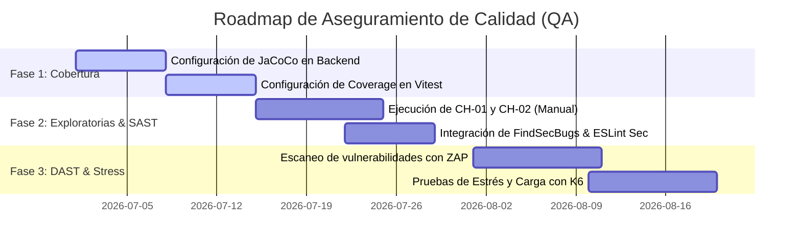

# Plan de Pruebas Avanzado y Roadmap de Calidad
## Catch & Go — Plataforma de Intermediación Laboral Temporal

---

## 1. Introducción y Objetivos
Este documento define el **Plan de Pruebas Avanzado y Estrategia de Aseguramiento de Calidad (QA)** para la plataforma Catch & Go. Al contar con una arquitectura distribuida (Frontend web en Next.js, Backend en microservicios Spring Boot, y una aplicación móvil nativa en Android/Kotlin), el proyecto requiere metodologías de pruebas que garanticen el rendimiento, la robustez funcional y la seguridad transaccional.

### Objetivos del Plan:
* **Estandarizar** el cálculo de cobertura de código para definir la cantidad de pruebas unitarias mínimas.
* **Garantizar la resiliencia** de los flujos críticos de negocio mediante pruebas exploratorias estructuradas.
* **Identificar vulnerabilidades de seguridad** de forma temprana mediante análisis estático (SAST) y dinámico (DAST).
* **Preparar la infraestructura** para soportar alta concurrencia mediante pruebas de estrés futuras.

---

## 2. Cálculo de la Cantidad de Pruebas Requeridas
Una de las preguntas clave en ingeniería de software es: *¿Cómo sabemos cuántas pruebas debemos realizar en nuestro código?* Para Catch & Go aplicaremos dos métricas científicas de la industria.

### A. Complejidad Ciclomática (Métrica de McCabe)
Determina la complejidad lógica de una función o método contando el número de caminos linealmente independientes a través de su código fuente. **El número de pruebas unitarias mínimas requeridas para un método debe ser igual a su Complejidad Ciclomática ($V(G)$)**.

La fórmula matemática es:
$$V(G) = P + 1$$
Donde:
* $P$ es el número de puntos de decisión o ramificaciones en el código (`if`, `while`, `for`, `case`, `&&`, `||`).

#### Ejemplo Práctico:
Si tenemos la función de scoring de matching en el `MatchingService`:
```java
public double calcularPuntaje(double distanciaKm, int habilidadesCoincidentes) {
    double puntaje = 0;
    if (distanciaKm <= 5.0) { // +1 decisión
        puntaje += 50;
    } else if (distanciaKm <= 10.0) { // +1 decisión
        puntaje += 30;
    }
    
    if (habilidadesCoincidentes >= 3) { // +1 decisión
        puntaje += 50;
    }
    return puntaje;
}
```
* **Puntos de decisión (P):** 3 estructuras condicionales.
* **Complejidad Ciclomática ($V(G)$):** $3 + 1 = 4$.
* **Pruebas JUnit necesarias:** 4 casos de prueba unitaria específicos para cubrir todas las ramas físicas del método.

---

### B. Métricas de Cobertura de Código (Code Coverage)
El porcentaje del código que es ejecutado al correr la suite de pruebas. El proyecto adoptará los siguientes **umbrales mínimos obligatorios (Quality Gates)**:

| Métrica | Cobertura Mínima | Descripción |
| :--- | :---: | :--- |
| **Line Coverage (Líneas)** | `80%` | Porcentaje de líneas de código individuales que ejecutan las pruebas. |
| **Branch Coverage (Ramas)** | `75%` | Porcentaje de caminos condicionales verdaderos/falsos ejecutados. |

#### Herramientas Recomendadas por Componente:
1. **Backend (Java / Spring Boot):** 
   * **Herramienta:** **JaCoCo** (Java Code Coverage Library).
   * **Implementación:** Agregar el plugin `jacoco-maven-plugin` al archivo `pom.xml` raíz para generar reportes en formato HTML tras correr `mvn clean test`.
2. **Frontend (Next.js / TypeScript):**
   * **Herramienta:** El proveedor integrado `@vitest/coverage-v8` en Vitest.
   * **Implementación:** Ejecutar `npx vitest run --coverage` para generar reportes visuales instantáneos de las líneas evaluadas.
3. **App Móvil (Android / Kotlin):**
   * **Herramienta:** Plugin de JaCoCo para Android/Gradle.
   * **Implementación:** Configurar tareas Gradle (`createDebugCoverageReport`) que analicen el código Kotlin compilado de la aplicación móvil.

---

## 3. Estrategia de Pruebas Exploratorias
Las pruebas exploratorias son pruebas de caja negra donde el analista de control de calidad aprende el comportamiento del software y diseña activamente los casos de prueba sobre la marcha. Para evitar que sean caóticas, se estructurarán mediante **Charters de Pruebas (Sesiones Enfocadas)** con tiempo limitado (Timeboxing de 45 a 90 minutos).

### Estructura de un Charter de Prueba Exploratoria:
```text
CHARTER ID: [Ejemplo: CH-01]
OBJETIVO: Explorar el comportamiento de [Módulo/Flujo] buscando debilidades de usabilidad y estabilidad.
ÁREAS DE ENFOQUE: [Lista de componentes o pantallas]
TIEMPO ESTIMADO: [Ej. 60 minutos]
ESCENARIOS EVALUADOS: [Acciones realizadas, datos de entrada inusuales]
RESULTADOS Y DEFECTOS: [Bugs encontrados, fallos de UI, problemas de latencia]
```

### Propuesta de Charters Críticos para Catch & Go:
* **CH-01 (App Móvil - Trabajador):** Evaluar el flujo de postulación rápida y geolocalización simulando una **conexión de red inestable o 3G débil** (conmutando entre redes móviles y Wi-Fi) para comprobar si la app almacena en caché la postulación o muestra un error amigable en lugar de cerrarse inesperadamente (Crash).
* **CH-02 (Frontend Web - Empresas):** Evaluar el módulo de pago y checkout. Interrumpir el flujo de pago con Webpay cerrando la pestaña bruscamente para verificar si el estado del pago en la base de datos se mantiene seguro e inconsistente o si se autolibera la transacción sin cobros huérfanos.

---

## 4. Pruebas de Seguridad: SAST y DAST

### A. SAST (Análisis de Seguridad Estático)
Consiste en analizar el código fuente sin ejecutarlo para detectar malas prácticas de programación, secretos expuestos o bibliotecas desactualizadas con vulnerabilidades conocidas.

* **Backend (Java):**
  * **Herramienta:** **SpotBugs** con la extensión **FindSecBugs**.
  * **Uso:** Analiza el bytecode compilado buscando patrones vulnerables comunes en Java (inyecciones SQL por concatenación de texto, uso de algoritmos hash inseguros como MD5, etc.).
* **Frontend (Next.js):**
  * **Herramienta:** Plugin `eslint-plugin-security` para ESLint.
  * **Uso:** Identifica llamadas peligrosas en JavaScript/TypeScript como la inyección de código mediante `eval` o manipulación insegura del DOM (`dangerouslySetInnerHTML`).
* **Dependencias de Terceros:**
  * **Herramienta:** **OWASP Dependency-Check**.
  * **Uso:** Escanea el `pom.xml` y `package.json` contra la base de datos nacional de vulnerabilidades (NVD) para advertir si las librerías importadas contienen fallos críticos conocidos.

---

### B. DAST (Análisis de Seguridad Dinámico) — Uso de OWASP ZAP
Las pruebas dinámicas evalúan la aplicación en tiempo de ejecución buscando brechas de seguridad visibles externamente (XSS, inyecciones, fugas de cabeceras HTTP, CSRF).

#### Herramienta Principal: OWASP ZAP (Zed Attack Proxy)
*(Nota: Referido comúnmente como "ZAP Proxy" o "Sampproxy")*

OWASP ZAP actúa como un "Man-in-the-Middle" (intermediario). Se coloca entre el cliente (Frontend / App Android) y el servidor (API Gateway) para interceptar, analizar e inyectar tráfico malicioso controlado con fines de prueba.

```
+------------+         HTTP/S         +-----------------+         HTTP/S         +-------------+
|  Frontend  |  ===================>  |  OWASP ZAP      |  ===================>  | API Gateway |
| / App Movil|                        |  (Proxy Interc) |                        |  (Backend)  |
+------------+                        +-----------------+                        +-------------+
```

#### Plan de Ejecución con OWASP ZAP:
1. **Escaneo Pasivo (Passive Scan):**
   * Configurar el navegador para dirigir el tráfico de Catch & Go a través del puerto local de OWASP ZAP (puerto `8080` por defecto).
   * Navegar manualmente por el flujo del sistema (login, búsqueda de trabajos, postulación).
   * ZAP analizará las cabeceras HTTP recibidas del backend buscando vulnerabilidades silenciosas, tales como cabeceras `X-Frame-Options` ausentes (riesgo de Clickjacking) o cookies de sesión JWT sin directivas `HttpOnly` y `Secure`.
2. **Escaneo Activo (Active Scan / Fuzzing):**
   * Seleccionar las peticiones críticas capturadas por ZAP (ej. `/auth/login` o `/jobs/create`).
   * Configurar ataques automatizados que envíen datos de entrada alterados (fuzzing) para comprobar si los endpoints toleran inyecciones SQL (`' OR '1'='1`) o inyecciones de scripts XSS (`<script>alert(1)</script>`).
   * Verificar que el API Gateway retorne códigos de estado HTTP `4xx` correctos con mensajes neutrales, impidiendo fugas de stacktrace de base de datos (`500 Internal Server Error`).

---

## 5. Estrategia de Pruebas de Estrés y Carga
Las pruebas de estrés determinan el límite físico del backend (API Gateway y base de datos) antes de fallar, y validan la capacidad del sistema para recuperarse automáticamente cuando cesa el pico de carga.

### Escenario de Carga Planificado para Catch & Go:
* **Escenario de Producción Esperado:** 100 usuarios activos concurrentes interactuando de forma simulada.
* **Escenario de Estrés:** Generar rampas de carga de hasta 2,000 usuarios concurrentes en un periodo de 5 minutos sobre los microservicios más exigentes:
  * `/matching/calculate` (Algoritmo de scoring espacial).
  * `/jobs/contingency-offers` (Búsqueda geográfica en tiempo real).

### Herramienta Recomendada: K6 (por Grafana)
Se selecciona **K6** en lugar de Apache JMeter debido a que las pruebas se programan en JavaScript, permitiendo versionar los scripts de carga directamente en la carpeta del repositorio y correrlos desde la terminal sin interfaces gráficas pesadas.

#### Ejemplo de Script K6 (`stress-test.js`):
```javascript
import http from 'k6/http';
import { sleep, check } from 'k6';

export const options = {
  stages: [
    { duration: '1m', target: 50 },  // Rampa de subida: 50 usuarios
    { duration: '3m', target: 200 }, // Carga sostenida: 200 usuarios
    { duration: '1m', target: 1000 },// Pico de estrés extremo: 1000 usuarios
    { duration: '1m', target: 0 },   // Rampa de bajada para evaluar recuperación
  ],
};

export default function () {
  const res = http.get('http://localhost:8080/jobs/active');
  check(res, {
    'status es 200': (r) => r.status === 200,
    'tiempo respuesta < 300ms': (r) => r.timings.duration < 300,
  });
  sleep(1);
}
```

---

## 6. Roadmap de Implementación de QA (Sprints)

Para no sobrecargar los equipos de desarrollo, se propone la integración de estas herramientas y pruebas de manera secuencial y ordenada:


